# bjfu电子系统综合设计（摔倒检测-FallDetection）

**1.0 Debug版本APK已发布，路径为APP-Debug，但短信还是有问题，权限必须手动全部开启，否则闪退，请谨慎尝试！！！！**

## arduino开发（全部完成）

总体思路是通过Arduino nano 采集陀螺仪与加速度数据并进行本地计算后通过蓝牙模块上传数据给上位机

但选板缺乏经验，nano没有扬声器和多个可控灯光，不过具体代码也在arduino中有体现，有需求可进一步研究

1.元件选型

arduino nanov3

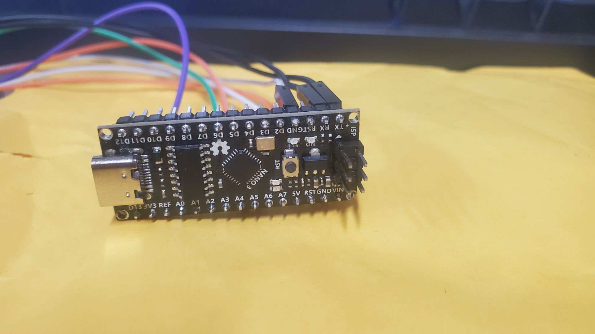

ITG+ADXL 陀螺仪与加速度传感器

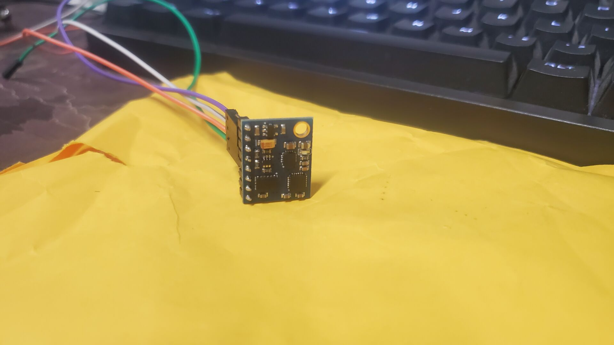

HC-05蓝牙模块

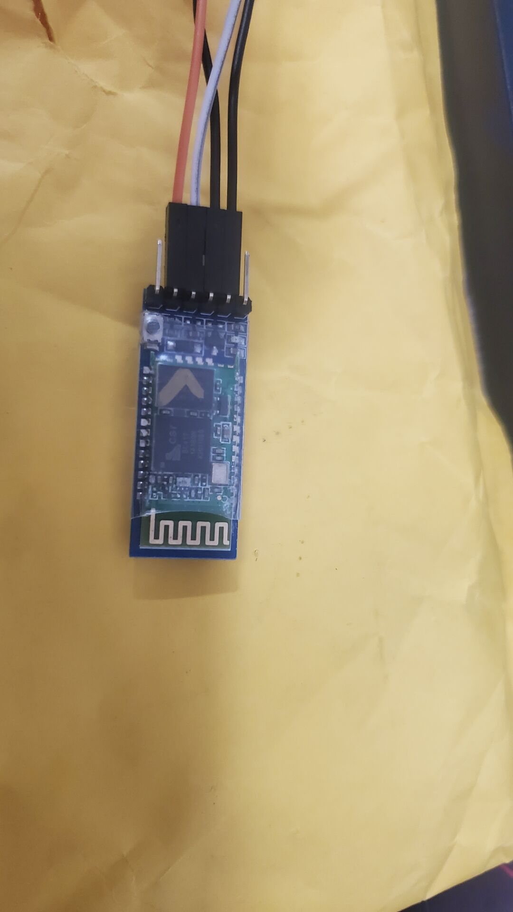

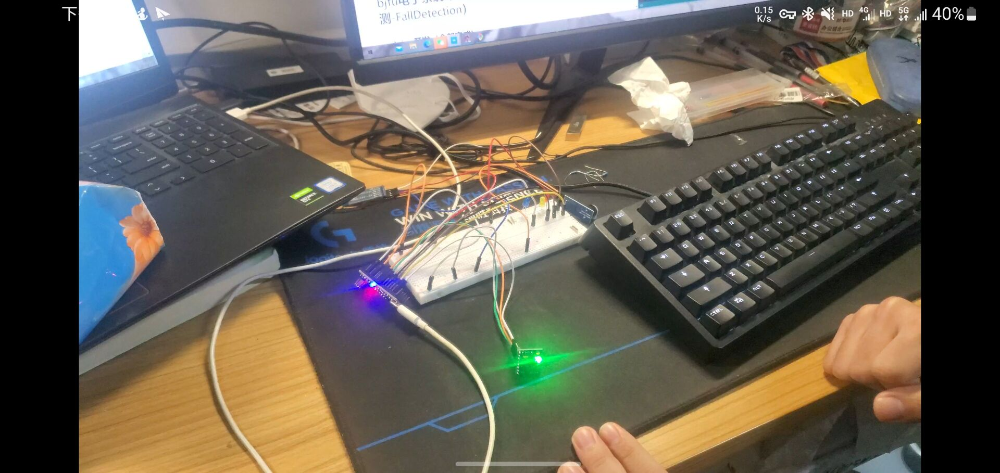


2.pcb(文件暂缺)

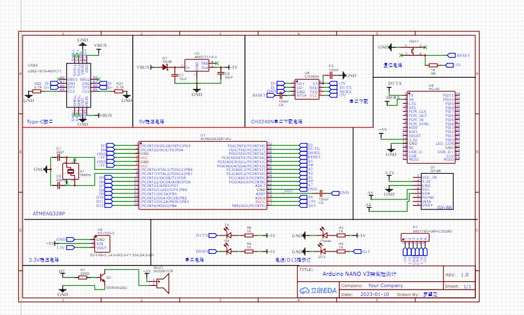

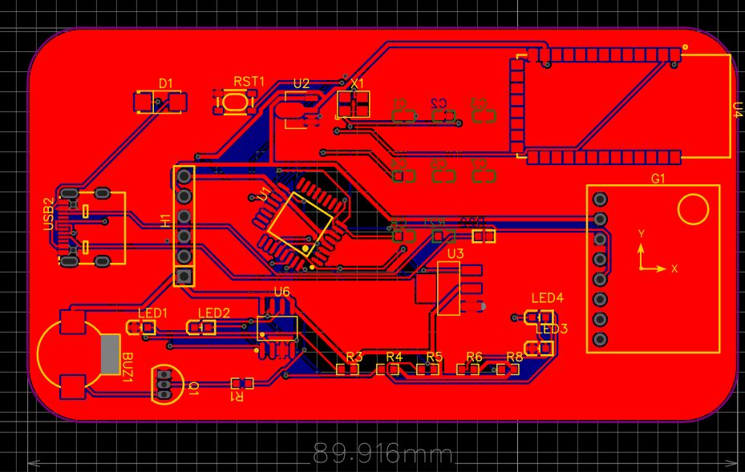


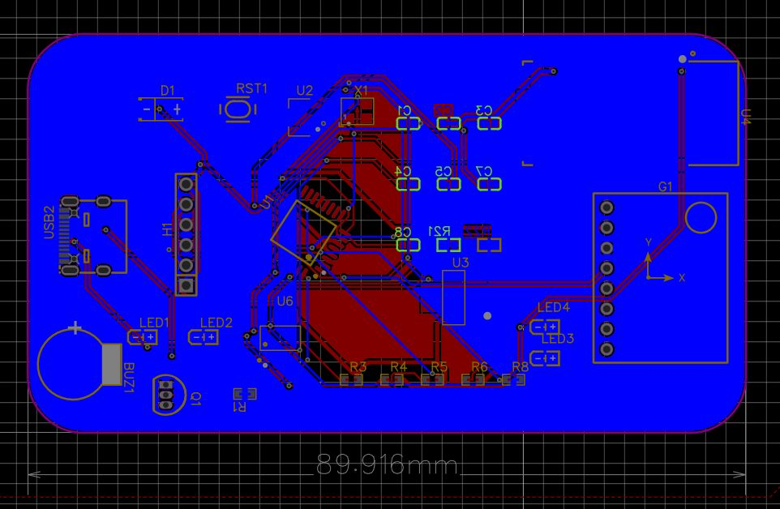

3.开发板验证(代码全在Arduino文件夹下)

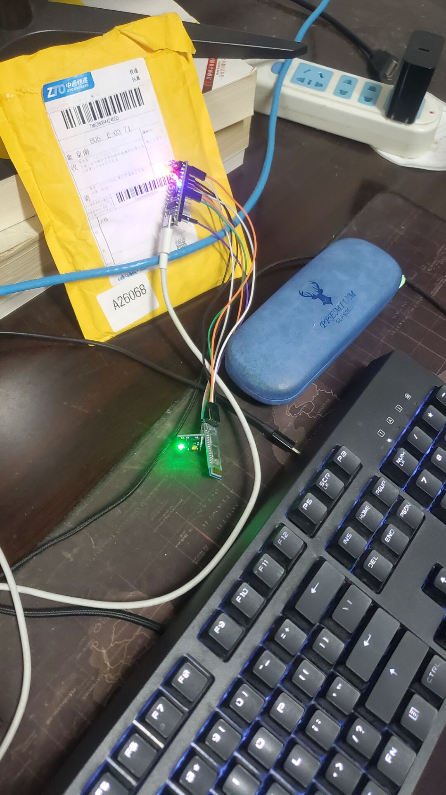

4.传感器信息采集

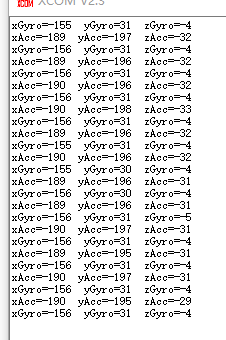

5.蓝牙通信

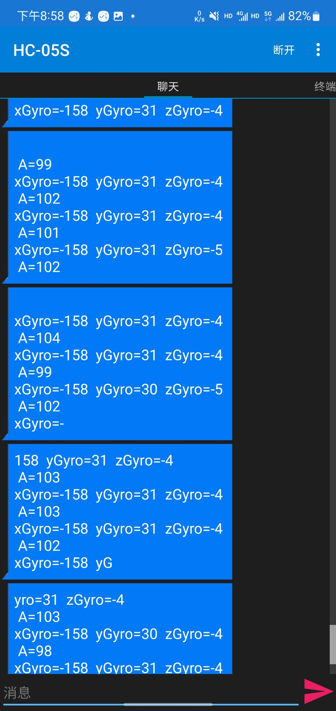

## 安卓app开发（demo完成）


### 1.环境配置 Android studio （ed）

​	google等原裝網站因为众所周知的原因上不去，需要设置镜像（也不太管用）

​	最好的办法还是在项目的build.gradle-repositories-添加阿里镜像

​	例：

```
repositories {
    maven { url 'https://maven.aliyun.com/repository/public'}
    maven() {
        url 'https://maven.aliyun.com/repository/jcenter'
    }
    maven(){
        url 'https://maven.aliyun.com/repository/google'
    }
    maven {
        url 'https://maven.aliyun.com/repository/public'
    }
    maven {
        url 'https://maven.aliyun.com/repository/mapr-public'
    }
    maven{
        url'https://maven.aliyun.com/repository/central'
    }

    mavenCentral ()
```

### 2.借鉴17年老版本代码，重构函数，使用新的AndroidX库，使用新的支持函数（ed）

[[lhy-nw1217/Fall-Detection: 老人跌倒检测app (github.com)](https://github.com/lhy-nw1217/Fall-Detection)

这个真的是一把鼻涕一把泪，这个直接让我放弃照抄，选择各类文档与借鉴重构一轮

在Android8.0之后，google对安全性的要求大大提升，对前台handler各种函数使用与防止内存泄露大大提升

```java
//旧
//    private Handler handler = new Handler(){
//        @Override
//        public void handleMessage(Message msg) {
//            switch(msg.what){
//                case FELL:
//                    Log.e(TAG, "FELL");
//                    //报警
////                    showAlertDialog();
//                    Intent intent = new Intent("com.broadcast.FALL_LOCAL_BROADCAST");
//                    localBroadcastManager.sendBroadcast(intent);
//
//                    break;
//
//            }
//
//        }
//    };

//新
    private Handler handler = new Handler(Looper.getMainLooper()) {
        @Override
        public void handleMessage(Message msg) {
            switch (msg.what) {
                case FELL:
                    Log.e(TAG, "FELL");
                    //报警
//                    showAlertDialog();
                    Intent intent = new Intent("com.broadcast.FALL_LOCAL_BROADCAST");
                    localBroadcastManager.sendBroadcast(intent);

                    break;
            }
        }
    };
```

以及对新线程悬浮窗的要求

```java
//新
@Override
public void onCreate() {
    super.onCreate();
    NotificationManager manager = (NotificationManager)getSystemService(NOTIFICATION_SERVICE);

    NotificationChannel Channel = new NotificationChannel(IMPORTANT_CHANNEL_ID,
            "FallDetection",NotificationManager.IMPORTANCE_HIGH);
    Log.d(TAG, "FallDetectionService.onCreate()");
    //mBluetoothAdapter = BluetoothAdapter.getDefaultAdapter();//获得蓝牙实例
    fallSensorManager = new FallSensorManager(this);
    fallSensorManager.initSensor();
    fallSensorManager.registerSensor();
    fall = new Fall();
    fall.setThresholdValue(25,5);
    running = true;
    //在通知栏上显示服务运行
    showInNotification();

    localBroadcastManager = LocalBroadcastManager.getInstance(this);
    intentFilter = new IntentFilter();
    intentFilter.addAction("com.broadcast.FALL_LOCAL_BROADCAST");
    fallLocalReceiver = new FallLocalReceiver();
    localBroadcastManager.registerReceiver(fallLocalReceiver, intentFilter);

    manager.createNotificationChannel(Channel);

}


//旧
 public void onCreate() {
        super.onCreate();
        Log.d(TAG, "FallDetectionService.onCreate()");
		//不开channel直接闪退，因为主线程无法完成建立
        fallSensorManager = new FallSensorManager(this);
        fallSensorManager.initSensor();
        fallSensorManager.registerSensor();
        fall = new Fall();
        fall.setThresholdValue(25,5);
        running = true;
        //在通知栏上显示服务运行
        showInNotification();

        localBroadcastManager = LocalBroadcastManager.getInstance(this);
        intentFilter = new IntentFilter();
        intentFilter.addAction("com.broadcast.FALL_LOCAL_BROADCAST");
        fallLocalReceiver = new FallLocalReceiver();
        localBroadcastManager.registerReceiver(fallLocalReceiver, intentFilter);
    }
```

很多细小的切换，debug确实是体力话

核心算法SVM 大量学习借鉴

```java
 /*
    跌倒检测
     */
    public  void fallDetection(){
        Log.d(TAG, "Fall.fallDetection()");
        new Thread(new Runnable() {
            @Override
            public void run() {
                boolean running = true;
                while(running){
                    //阈值法
                    for(int i = 0; i < svmFilteringData.length; i++){
                        if(svmFilteringData[i] <= lowThresholdValue){
                            if(i < svmFilteringData.length-10){
                                for (int j = i; j < i + 10; j++) {
                                    if (svmFilteringData[j] >= highThresholdValue) {
                                        running = false;
                                        setFell(true);
                                    }
                                }
                            }else {
                                for (int j = i; j < svmFilteringData.length; j++) {
                                    if (svmFilteringData[j] >= highThresholdValue) {
                                        running = false;
                                        setFell(true);
                                    }
                                }
                                for (int k = 0; k < (10-(svmFilteringData.length - i)); k++){
                                    if (svmFilteringData[k] >= highThresholdValue) {
                                        running = false;
                                        setFell(true);
                                    }
                                }
                            }
                        }
                    }

                }
            }
        }).start();
    }

    /*
    3s内svm原始数据收集
     */
    public static void svmCollector(float svm){

        if(svmCount < svmData.length){
            svmData[svmCount] = svm;
        }else{
            svmCount = 0;
            svmData[svmCount] = svm;
        }
        svmCount++;
//        Log.d(TAG, "Fall.svmCollector" + svmData[svmCount]);
    }

    /*
    svm中值滤波
     */
    public static void setSvmFilteringData(){
        //中值滤波取的三个值
        float s1, s2, s3, temp;
        //冒泡排序
        for (int i = 0; i < svmFilteringData.length-1; i++){
            if(i == 0){
                s1 = svmData[i];
                s2 = svmData[i + 1];
                s3 = svmData[i + 2];
            }else if(i < svmFilteringData.length-2){
                s1 = svmData[i - 1];
                s2 = svmData[i];
                s3 = svmData[i + 1];
            }else{
                s1 = svmData[i - 1];
                s2 = svmData[i];
                s3 = svmData[0];
            }
            if(s1 > s2){
                temp = s1;
                s1 = s2;
                s2 = temp;
            }
            if(s2 > s3){
                temp = s2;
                s2 = s3;
                s3 = temp;
            }
            svmFilteringData[i] = s2;
            Log.d(TAG, s1 + " " + s2 + " " + s3);
//            Log.d(TAG, "Fall.setSvmFilteringData" + svmFilteringData[i]);
        }

    }

    public boolean isFell() {
//        Log.e(TAG, "isFELL" + isFell);
        return isFell;

    }

    public void setFell(boolean fell) {
        isFell = fell;
//        Log.e(TAG, "setFELL" + isFell);
    }

    public void cleanData(){
        Log.d(TAG , "Fall.clean()");
        for (int i = 0; i < svmData.length; i++){
            svmData[i] = 0;
        }
        //中值滤波
        for (int i = 0; i < svmFilteringData.length; i++){
            svmFilteringData[i] = 0;
        }
    }
}
```


### 3.全局替换旧的函数和包支持（ed）

​	重构-迁移到AndroidX-确认

​    不能过分相信全局搜索，多检索子页面的xml，把所有的由support库转为新的Androidx库

​	继续修改一切xml中使用旧支持的，例如**抽屉类**

### 4. debug，handler闪退（ing）

​	安卓8.0以上必须手动建立进程Channel，否则报错

​	弹窗权限错误：Android: permission denied for window type 2038

​	xml加入<uses-permission android:name="android.permission.SYSTEM_ALERT_WINDOW" />

```java
 alertDialog.getWindow().setType(WindowManager.LayoutParams.TYPE_APPLICATION_OVERLAY)
```

 给新的权限TYPE_APPLICATION_OVERLAY

这些闪退应该都是权限不足的问题，把应给的权限全部给了就没有问题了

还有得对设置的所有项目进行输入，貌似null也会闪退

（写完短信发送记得destroy 线程，不然就会有329条短信的短信费用）


### **5.地图API引入**

天坑之一，19年之后加强数据审核，高德等厂商对API的使用加强了审查，具体申请都按教程来，但是使用时有了新的要求，需要强制开权限，否则报错，并且new AMapLocationClient时必须使用try-catch，保证null能启动

```java
//强制开权限
AMapLocationClient.updatePrivacyShow(this,true,true);
AMapLocationClient.updatePrivacyAgree(this,true);
//初始化定位
try {
    mLocationClient = new AMapLocationClient(this);
} catch (Exception e) {
    e.printStackTrace();
}
```

​	并且不要用推荐的导入方式


当你没有使用最新的API也报错，老实使用

```gradle
//implementation 'com.amap.api:location:latest.integration' //狠狠报错
//implementation 'com.amap.api:location:6.2.0' //这个版本高德偷懒没更新合包信息，直接注释掉
implementation files('libs/AMap3DMap_9.5.0_AMapLocation_6.2.0_20221103.jar')//把支持的包导入
```

​	


### 5.修改数据传入，使用外来蓝牙串口数据检测（todo）

某种意义上有些多余，这个目标我觉得可以把本应用移植到wear os实现

### 6.小bug

1.当一次警报结束后，监控线程结束了但主页面开始仍显示打开

2.权限还是得手动开启，没有写handler 到前台申请

## **成品展示**

因为小模块选型失误，现在手头上大家都有的带加速度和陀螺仪的东西毫无疑问是智能手机，故决定开发一款智能手机软件作为本系统的上位替代

某种意义上也算是集成化？

此APP具有摔倒检测功能，通过收集传感器数据判断是否摔倒

检测到摔倒后可振动，发出声音并会对紧急联系人发出短信，包含位置与时间

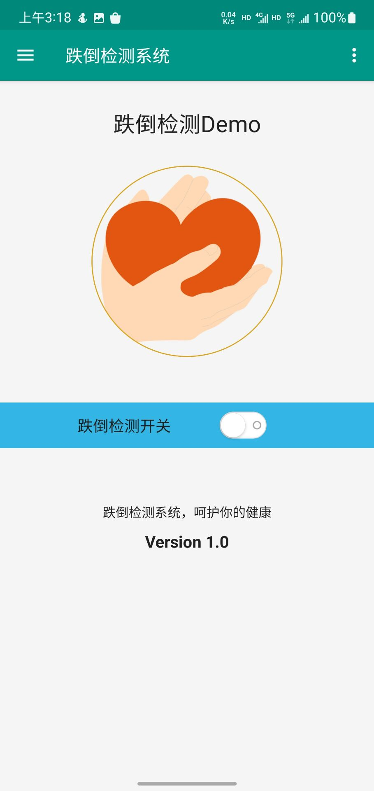

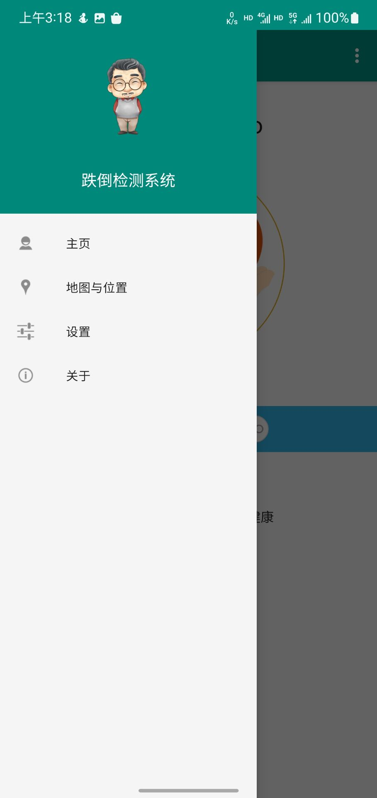

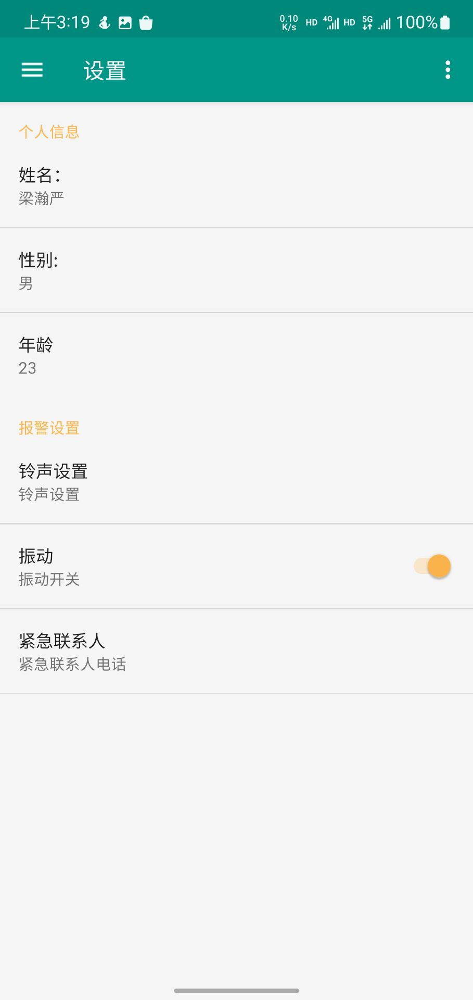

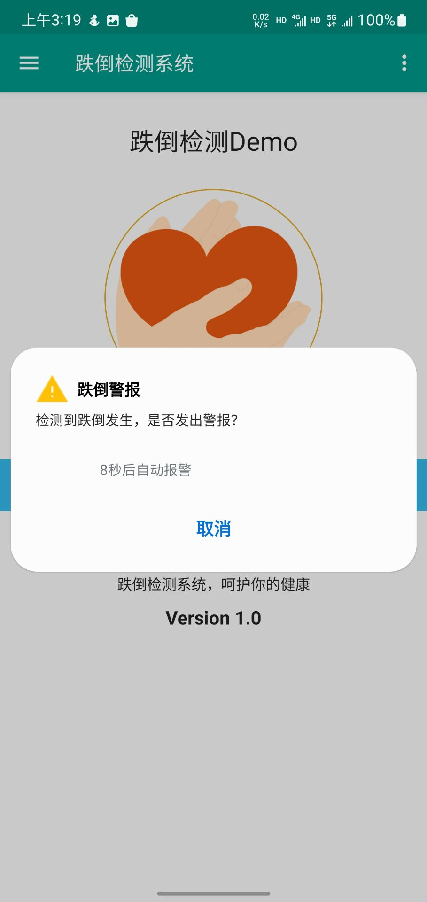

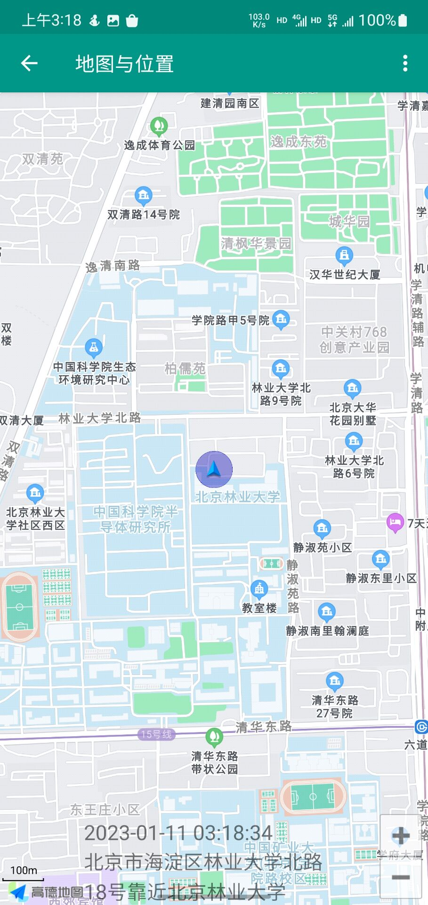

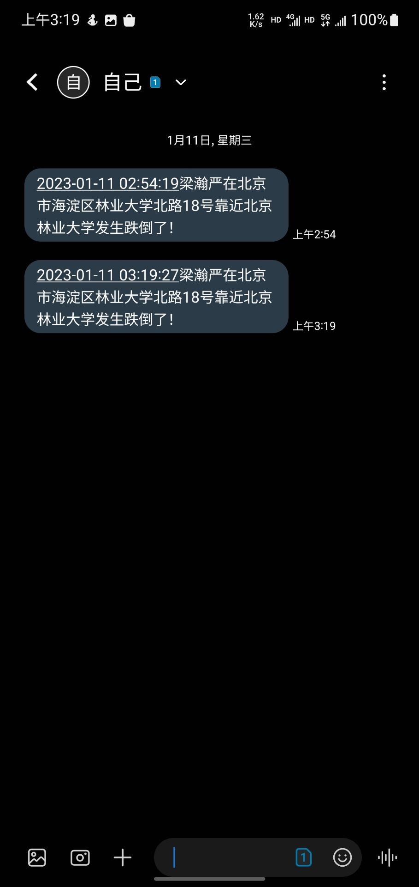